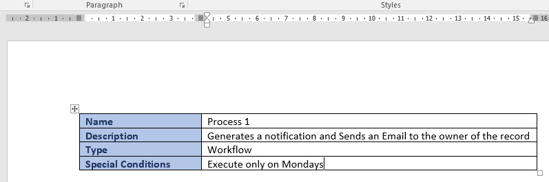
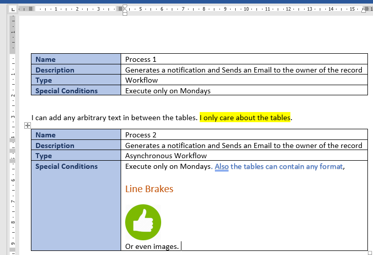
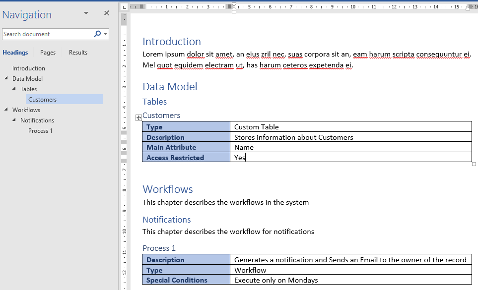

[](https://ci.appveyor.com/project/crisfervil/wordmarkdown)

# WordMarkdown
Converts Specifications written in Microsoft Word into a Json file

# Description

As developers, most of the time we receive our specifications/requirements from the Business in Word Documents.

When we work in agile environments, the requirements are usually divided in smaller user stories, so these documents are not so long. But, whether we like it or not, there are still a lot of Waterfall style projects out there. 

In Waterfall methodologies, the documents are not so short, as all the requirements are gathered first, and when they are mature enough, they are released to the development team.

Very often, these documents contains a lot of information that has to be translated into code, data models, configurations and all sort of software pieces that are stick together to create the desired system. 

The development team has to go through it copying the user story contents into code, database scripts, configuration data, user automated tests, or whatever is required to convert the specifications into something useful.

But, wouldn't it be great if we somehow can extract what is written in those documents and automatically convert them into software? Wouldn't that increase our productivity and reduce the errors introduced by manual tasks?

Even more, what if we could agree on a few Word templates, where the Business Analysts/Product Owners can write the specifications in a way that is human readable AND machine processable at the same time?

That is exactly the goal of WordMarkdown. 

Using a couple of Word features; tables and paragraph outlines, we are able to structure the information in a way that can be converted into a Json document. 

Json is a standard format that is easily readable and processed by any program, to generate code or perform any other automated activities. 

Let's see some examples. Say for example the following table:



By running WordMarkdown I can extract that information and get the following Json:

``` json
[
  {
    "Name": "Process 1",
    "Description": "Generates a notification and Sends an Email to the owner of the record",
    "Type": "Workflow",
    "Special Conditions": "Execute only on Mondays"
  }
] 
```

But that's too simple. Let's make it more complicated. What If I have now several tables like the previous one, one after the other. We can include also formatting and images.
What would I get?



The generated Json would be:

``` json
[
  {
    "Name": "Process 1",
    "Description": "Generates a notification and Sends an Email to the owner of the record",
    "Type": "Workflow",
    "Special Conditions": "Execute only on Mondays"
  },
  {
    "Name": "Process 2",
    "Description": "Generates a notification and Sends an Email to the owner of the record",
    "Type": "Asynchronous Workflow",
    "Special Conditions": "Execute only on Mondays. Also the tables can contain any format, Line BrakesOr even images. "
  }
]
```
That's cool, but how can I combine this and the paragraph outlines?

The paragraph outlines are a style property available in Microsoft Word that lets you organize any document in chapters and sub chapters. You can explore the sections using the Navigation Panel.



The above will generate the following output:

```json
{
  "Introduction": null,
  "Data Model": {
    "Tables": {
      "Customers": {
        "Type": "Custom Table",
        "Description": "Stores information about Customers",
        "Main Attribute": "Name",
        "Access Restricted": "Yes"
      }
    }
  },
  "Workflows": {
    "Notifications": {
      "Process 1": {
        "Description": "Generates a notification and Sends an Email to the owner of the record",
        "Type": "Workflow",
        "Special Conditions": "Execute only on Mondays"
      }
    }
  }
}
```

These are all very simple examples, and in real life things get more complicated. But it is a beginning and a work in progress. 

I see this as a tool to close the gap between Business Analysts and Developers, where all the hard work made by former can be more effectively reutilized, without asking them to learn new tools or programming languages. We can all work in the tools we already know very well; Office tools for Business people, and programming languages for developers. 

TBC

# How to generate code fom JSon

TBC

# Language specification

TBC

# How to install

TBC

# How to use it

TBC

# Backlog

TBC